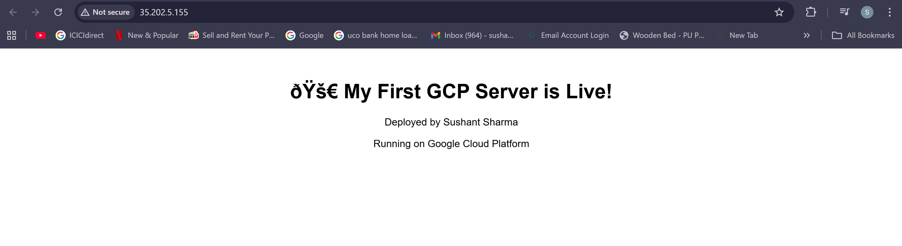
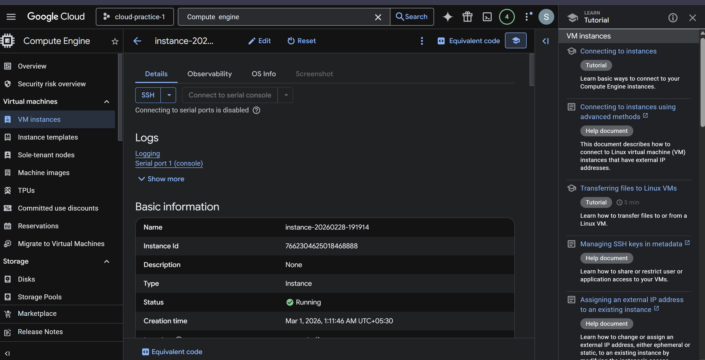
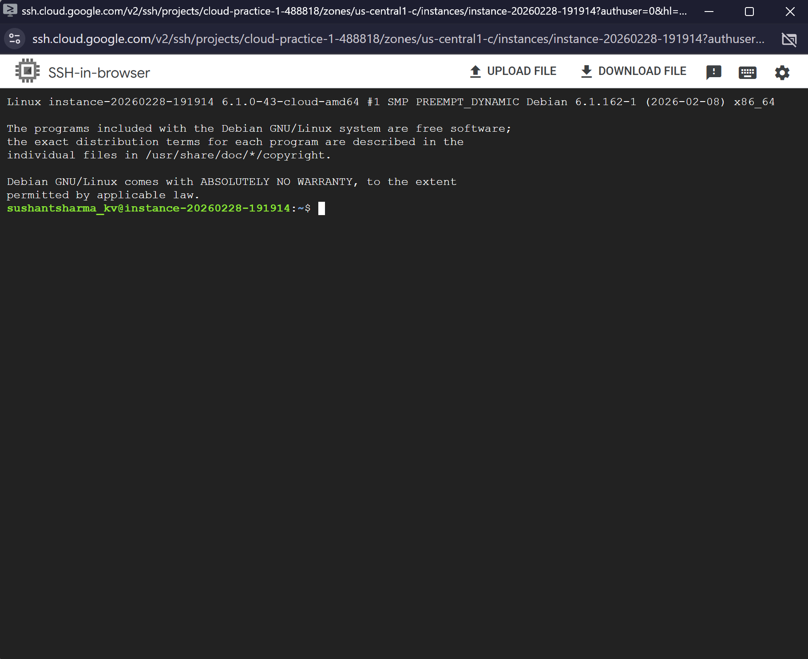

# gcp-vm-web-server-project
Deployment of a Linux-based web server on Google Cloud Compute Engine with firewall configuration and Nginx setup.
# 🚀 GCP First Server

**Hands-on deployment of a live website on Google Cloud Platform.**  
A beginner-friendly project demonstrating practical cloud skills and server management.

---

## 💡 Overview

Launched a VM on GCP, installed Apache, and deployed a live website. Verified deployment with screenshots and practiced **cloud cost management** by stopping the VM.  

**Key takeaways:**  
- Ability to deploy and manage cloud infrastructure  
- Basic Linux/Apache server skills  
- Attention to cloud best practices (cost-safe operations)  

---

## 🛠️ Skills & Tools

- **Cloud:** Google Cloud Platform — Compute Engine  
- **Server:** Apache Web Server  
- **OS:** Linux commands & file editing (`nano`)  
- **Documentation:** Screenshots & README for portfolio  

---

## 📋 Steps

1. Created a free-tier eligible VM on GCP.  
2. Installed Apache web server.  
3. Edited `/var/www/html/index.html` to deploy a custom page.  
4. Verified live website: `🚀 My First GCP Server is Live!`  
5. Took screenshots for proof.  
6. Stopped VM to avoid billing.

---

## 📸 Proof (Screenshots)

- **Website:**   
- **VM Dashboard:**   
- **Terminal Commands:**    

---

## ✅ Outcome

Successfully deployed a live HTML page on GCP, showing **real hands-on cloud skills** for portfolio and resume use.  

> Recruiters can immediately see **deployment, cloud setup, and cost discipline** in a single glance.
